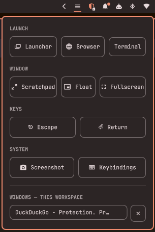

# WM Actions

A compact Omarchy bar widget: a mouse-only grid of common Hyprland actions plus a switcher for windows on the current workspace.

Click the bar icon to open a panel with four action groups and a live list of windows on the focused workspace.



## Why

Built for dual-monitor setups where one screen is driven from a different PC and the keyboard is switched over to it (KVM, Bluetooth, whatever). Reaching for a Hyprland keybind on the Omarchy side then means reconnecting the keyboard first. This widget puts the common actions and a workspace window switcher behind mouse clicks instead, so you don't have to switch input back just to float a window, open an app, or check a keybinding.

## Actions

- **LAUNCH** - Launcher, Browser, Terminal
- **WINDOW** - Scratchpad toggle, Float toggle, Fullscreen toggle
- **KEYS** - Escape, Return (sent as synthetic key presses)
- **SYSTEM** - Screenshot, Keybindings cheat sheet

## Windows - this workspace

Below the action grid, the panel lists every window on the currently focused workspace (title, truncated to fit). Click a window to focus it, or the ✕ next to it to close it. The list refreshes automatically whenever the panel opens.

## Requirements

- [Omarchy](https://omarchy.org/) (shell plugins)
- Hyprland (all actions dispatch through `hyprctl`)

## Install

```bash
omarchy plugin add https://github.com/blafusel/omarchy-wm-actions.git --enable
```

## Configure

The widget defaults to the **right** section of the bar. To move it:

```bash
omarchy bar move io.github.blafusel.wm-actions --section <left|center|right>
```

## Remove

```bash
omarchy plugin remove io.github.blafusel.wm-actions
```

To disable it but keep the files:

```bash
omarchy plugin disable io.github.blafusel.wm-actions
```

## License

MIT. See [LICENSE](LICENSE).
