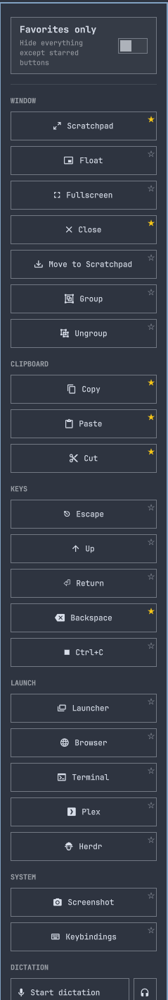

# WM Actions

A compact Omarchy bar widget: a mouse-only floating panel of common Hyprland actions, clipboard, dictation, plus a switcher for windows on the current workspace.

Click the bar icon to open the panel. Middle-click it to toggle the scratchpad directly, no panel needed. Right-click it to jump straight into **Audio only** mode (see below). It's a standalone floating window (`PanelWindow`, `WlrKeyboardFocus.None`), not the usual click-away-to-dismiss bar popup:

- **It never steals keyboard focus.** Opening it or clicking its buttons doesn't touch whatever window you were using — verified live (a synthetic keypress reaches a focused terminal while the panel is open). This is what makes the DICTATION switch actually work: the window you're dictating into keeps focus the whole time.
- **It doesn't swallow clicks.** There's no full-screen catcher, so clicking another window while this panel is open reaches that window normally, and the panel never auto-closes after firing an action — it only closes via the bar icon or IPC.
- Tradeoff versus a standard bar popup: no fade animation, no click-away-to-dismiss, and no mutual exclusion with other bar popups.



## Why

Built for dual-monitor setups where one screen is driven from a different PC and the keyboard is switched over to it (KVM, Bluetooth, whatever). Reaching for a Hyprland keybind on the Omarchy side then means reconnecting the keyboard first. This widget puts the common actions and a workspace window switcher behind mouse clicks instead, so you don't have to switch input back just to float a window, open an app, or check a keybinding.

## Actions

- **WINDOW** - Scratchpad toggle, Float toggle, Fullscreen toggle, Close, Move to Scratchpad, Group, Ungroup
- **CLIPBOARD** - Copy, Paste, Cut
- **KEYS** - Escape, Up (hold to repeat), Return, Backspace (hold to repeat), Ctrl+C (sent as synthetic key presses)
- **LAUNCH** - Launcher, Browser, Terminal, Plex, Herdr (opens in a terminal -- no `.desktop` file, it's a CLI tool)
- **SYSTEM** - Screenshot, Keybindings cheat sheet
- **DICTATION** - Start/stop switch for Voxtype dictation (`voxtype record toggle`), live state pulled from `omarchy-voxtype-status`; a Cancel button (mic-off icon) appears next to it while recording/transcribing to discard instead of transcribing (`voxtype record cancel`); a headphones icon next to that switches to **Audio only** mode

WINDOW's last four buttons act on whatever window had focus right before the panel opened: **Close** closes it, and **Move to Scratchpad** sends it to the scratchpad, remembering which workspace it came from. This is a per-window move, different from the **Scratchpad** button above it, which just toggles the whole special scratchpad workspace's visibility without moving anything.

**Group** and **Ungroup** are one-way: clicking Group is a no-op if the window's already grouped (and likewise Ungroup if it isn't), instead of both buttons sharing Hyprland's own single toggle dispatcher and doing the wrong thing depending on current state. Group still uses that toggle (confirmed live: it only ever grouped/ungrouped a lone window on its own). Ungroup doesn't -- the same toggle, targeted at one window's address, dissolved an entire multi-window group instead of removing just that one (confirmed live on a real group). Ungroup instead runs `HL.Group:remove(window)` via `hyprctl eval`, which removes only the targeted window and leaves the rest of the group intact.

Bringing a window back out is a separate step, on purpose: by the time you come back for something you stashed "for later," focus has moved on, so there's nothing meaningful left for a single Stash/Restore toggle to act on. Instead, every window actually sitting in the scratchpad shows up in its own **STASHED** list further down — click one to restore it (to its remembered origin workspace, or the current workspace if it got into the scratchpad some other way), or ✕ to close it outright.

Since the panel stays open across workspace switches, the captured window, the STASHED list, and the windows list below all stay live too — driven off Hyprland's own event stream, not just a one-time snapshot from when the panel opened.

KEYS targets the window that had focus right before the panel opened explicitly (via `send_key_state`'s `window` field), rather than relying on ambient seat focus — clicking a button in the panel is itself a pointer event on the panel's own surface, which was enough to disrupt plain ambient-focus delivery.

**Backspace** repeats while held down, like a real key: an initial ~450ms delay, then fires roughly every 75ms until released. The first press is a full-weight dispatch (explicit refocus, then a settled down/up `send_key_state` pair) same as Escape/Return; every repeat tick after that uses a lighter, faster path with no refocus/settle (focus is already correct once you're holding a button down) — that's what lets the repeat rate go this fast without the repeats just resetting each other's timers into never firing at all.

CLIPBOARD doesn't send SUPER+C/V/X anymore. Hyprland's global "Universal clipboard" binds never fire for synthetic virtual-keyboard input at all — confirmed directly: even `SUPER+S` (toggle scratchpad) silently no-ops when sent this way, the workspace never changes. Global keybinds apparently only respond to real hardware input, likely a deliberate compositor-level boundary. Copy/Cut instead read the Wayland **primary selection** (auto-populated by most apps/terminals whenever text is selected, no keypress involved at all) and write it to the clipboard directly; Cut then removes the selection with a plain Delete key. Paste sends an ordinary Ctrl+V (Shift+Insert in a terminal, where Ctrl+V usually means something else) — a normal app/terminal-level shortcut, not a compositor bind, so it's delivered reliably the same way Escape/Return are.

## Favorites

Every button in WINDOW/CLIPBOARD/KEYS/LAUNCH/SYSTEM has a small star in its corner — click it to favorite that button, independently of the button's own action. A "Favorites only" switch at the top of the panel hides everything except starred buttons (and hides a section entirely once nothing in it is starred). DICTATION and the window switcher below are always shown, filter or not. Favorites persist in `~/.config/omarchy/shell.json` (this widget's own bar-layout entry), so they survive shell restarts.

## Audio only

Shrinks the panel down to a tiny top-right widget with just the dictation switch (and Cancel, while recording) — for when you only need to start/stop dictation and the full grid is in the way. Enter it from the headphones icon next to DICTATION, or by right-clicking the bar icon. Exit with the ✕ on the widget, which also resets the mode back to full for next time; closing it via the bar icon or IPC instead (without hitting ✕) leaves Audio only as the remembered mode, so the next open lands back in it.

Persisted the same way as Favorites only, in this widget's shell.json entry — the bar icon's single click just opens/closes whatever mode was last active.

## Settings

A "Settings" entry at the top of the panel expands into:

- **Windows overview** / **Stash overview** toggles — hide the WINDOWS/STASHED lists further down.
- **Single column** — stacks the action grid one button per row instead of three. The card narrows to fit the widest visible button (floored so the Favorites/Settings toggle rows never truncate), and the whole panel becomes scrollable once stacked content runs past the screen's usable height.
- **Pin panel** — reserves real screen space along the panel's edge (tiled windows get pushed clear of it instead of tiling underneath) and reopens the panel automatically whenever the omarchy shell restarts. Manually closing it afterward still works as normal.
- Per-button **Enable/Disable**, grouped by category (CLIPBOARD/KEYS/LAUNCH/SYSTEM) — hides a button from the grid without touching the plugin's code.
- **Add new app…** — opens a terminal running `claude` (Claude Code) in this plugin's directory with a prompt to ask which app, find its `.desktop` id, pick an icon, and wire it into LAUNCH following this repo's own conventions. Needs a keyboard/TTY, unlike the rest of this mouse-only panel — meant for the machine you develop on, not the KVM target.

All of the above persist in shell.json like Favorites.

Every button's tooltip wraps at a fixed max width instead of the kit's default single unbounded line, so long ones (e.g. Move to Scratchpad's) don't overflow past the card's edge -- most noticeable once the card narrows down in Single column mode.

## Windows - this workspace

Below the action grid, the panel lists every window on the currently focused workspace (title, truncated to fit). Click a window to focus it, or the ✕ next to it to close it. The list refreshes automatically whenever the panel opens.

## Requirements

- [Omarchy](https://omarchy.org/) (shell plugins)
- Hyprland (all actions dispatch through `hyprctl`)
- Voxtype (`omarchy voxtype install`) for the DICTATION switch; without it the button just no-ops

## Install

```bash
omarchy plugin add https://github.com/blafusel/omarchy-wm-actions.git --enable
```

## Configure

The widget defaults to the **right** section of the bar. To move it:

```bash
omarchy bar move io.github.blafusel.wm-actions --section <left|center|right>
```

## Remove

```bash
omarchy plugin remove io.github.blafusel.wm-actions
```

To disable it but keep the files:

```bash
omarchy plugin disable io.github.blafusel.wm-actions
```

## Changelog

- **1.5.2** — Fixed Ungroup: the toggle dispatcher it used to use, targeted at one member's address, dissolved the entire group instead of just removing that window (confirmed live on a real multi-window group). Now uses `HL.Group:remove(window)` via `hyprctl eval` instead, which correctly leaves the rest of the group intact.
- **1.5.1** — Added WINDOW > Group and Ungroup. Hyprland only exposes grouping as a single toggle dispatcher, so each button checks the captured window's current group state first and no-ops rather than flipping the wrong way.
- **1.5.0** — Added LAUNCH > Herdr. Added Settings > Single column (scrollable, card narrows to fit the widest button) and Pin panel (reserves screen space along its edge, reopens automatically on shell restart). Tooltips now word-wrap at a fixed max width instead of overflowing past the card's edge. Renamed WINDOW > Stash to Move to Scratchpad to match what it actually does.
- **1.4.6** — Added KEYS > Up (hold to repeat) and Ctrl+C. Added a dictation Cancel button (discards instead of transcribing) and an Audio only mode (compact top-right dictation-only widget, persisted, entered via headphones icon or right-clicking the bar icon). Middle-click the bar icon to toggle the scratchpad directly. Added a Settings menu: Windows/Stash overview toggles, per-button enable/disable by category, and an "Add new app…" action that opens Claude Code to implement a new LAUNCH button. Fixed the Terminal button's missing icon.
- **1.4.5** — Added LAUNCH > Plex, launched via `gtk-launch plex-desktop_plex-desktop` (desktop-file id, not a hardcoded binary path, so it works regardless of install method).
- **1.4.4** — Backspace repeats roughly twice as fast (~75ms instead of ~150ms): repeat ticks now use a lighter dispatch path that skips the explicit refocus/settle the first press still does, since focus is already correct once you're holding a button down.
- **1.4.3** — Backspace now repeats while held down (initial ~450ms delay, then every ~150ms) instead of needing one click per character.
- **1.4.2** — Added KEYS > Backspace.
- **1.4.1** — Fixed CLIPBOARD: Copy/Paste/Cut sent SUPER+C/V/X expecting Hyprland's global "Universal clipboard" binds to fire, but those never respond to synthetic input at all (confirmed directly: even `SUPER+S` silently no-ops the same way). Copy/Cut now read the Wayland primary selection instead (no keypress involved); Paste sends a plain Ctrl+V/Shift+Insert.
- **1.3.2** — Fixed Restore: the old single Stash/Restore toggle button only ever tracked the last-focused window, so it broke the moment focus moved on (the entire point of stashing something "for later"). Replaced with a dedicated STASHED list showing every window actually in the scratchpad, each independently restorable to its remembered origin workspace (or the current one, if it got there some other way).
- **1.3.1** — The windows list and the WINDOW section's Stash/Restore button now update live while the panel stays open (workspace switches, window open/close/move, focus changes), driven off Hyprland's event stream instead of a one-time snapshot from when the panel opened.
- **1.3.0** — Added favorites: a star on every WINDOW/CLIPBOARD/KEYS/LAUNCH/SYSTEM button, plus a "Favorites only" filter. Persisted via `bar.shell.updateEntryInline` (same mechanism the tray uses for pinned items) into this widget's shell.json entry.
- **1.2.2** — Reordered sections: WINDOW, CLIPBOARD, KEYS, LAUNCH, SYSTEM.
- **1.2.1** — Removed the "Keep panel open" pin: the panel already never auto-closes after firing an action, so the toggle was redundant. It now closes only via the bar icon or IPC.
- **1.2.0** — Added WINDOW > Close and Stash/Restore (send the focused window to/from the scratchpad, remembering its origin workspace). Fixed Return/Escape/CLIPBOARD not reaching apps whose own JS resets focus on window-blur (e.g. web-based chat inputs): explicit refocus + a short settle delay before the synthetic keypress.
- **1.1.0** — Standalone floating panel (`PanelWindow`, `WlrKeyboardFocus.None`) replacing the click-away bar popup, so the panel never steals keyboard focus and never swallows clicks meant for other windows. Added CLIPBOARD (Copy/Paste/Cut), DICTATION, and the "Keep panel open" pin. CLIPBOARD/KEYS now target the pre-open focused window explicitly via `send_key_state`'s `window` field.
- **1.0.0** — Initial release: LAUNCH/WINDOW/KEYS/SYSTEM action grid plus the current-workspace window switcher.

## License

MIT. See [LICENSE](LICENSE).
